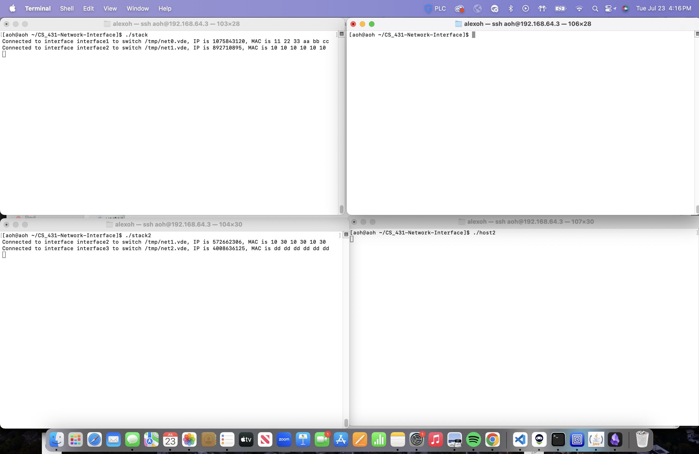
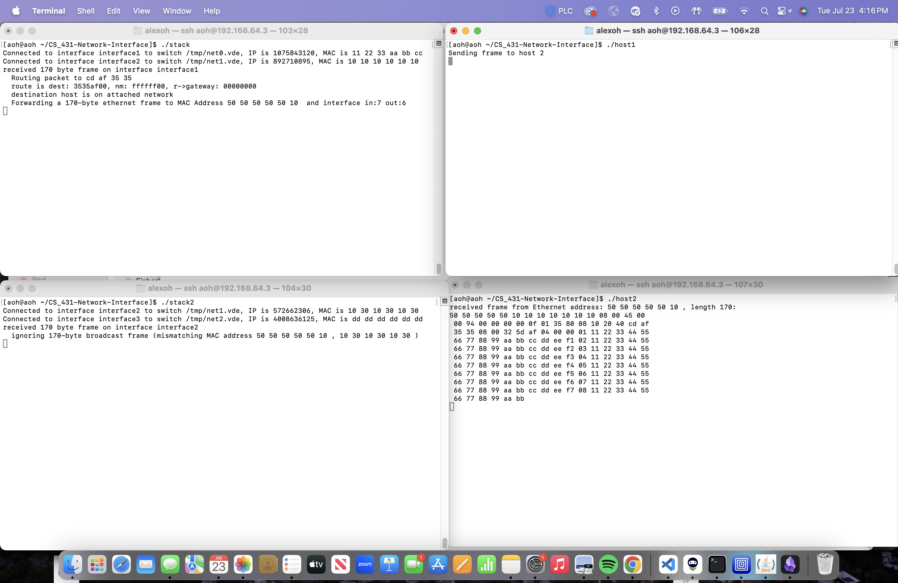
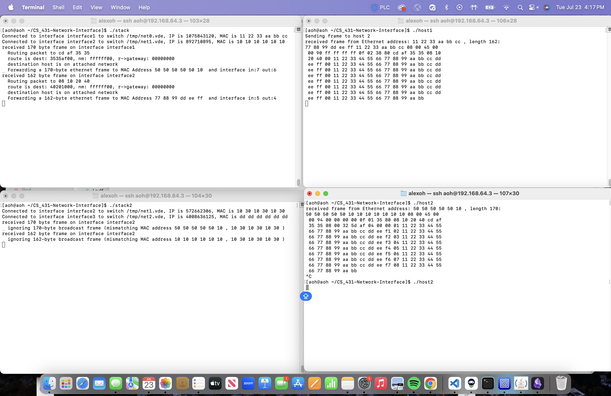
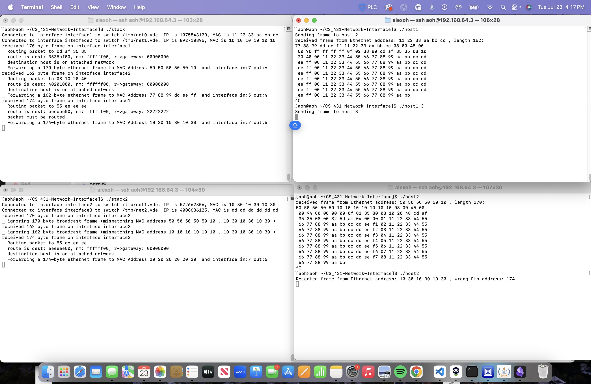
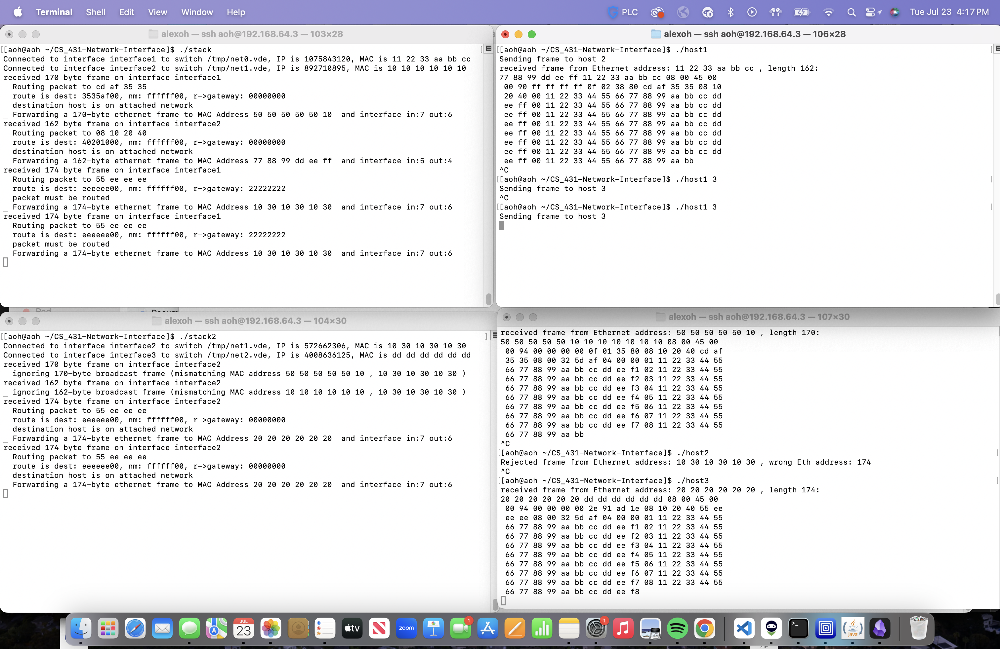

# Network Simulation 

This repository contains the majority of my work from the Computer Networks class. The final lab was a network simulation which mimiced the behavior of a network router and the protocols by which they operate. 

I ran a FreeBSD virtual environment with multiple connected terminals in which I tested all of my code. The `vde_switch` command creates a virtual switch which processes can connect to in order to simulate a network's behavior. I also utilized Wireshark to listen on the switch to the packages being sent and debugged. I could connect several processes to the switch and send frames between processes. Processes could represent hosts or routers and each has their own Ethernet and IP address. 
I implement a network router connected to two switches that currently receives ethernet frames and checks them for destination/source addresses, valid frame check sequence, and frame size. I extended the interface to implement Ethernet, IP, ARP, ICMP, and TCP protocols when receiving frames and routing them to other switches. The router may receive frames from multiple sources and route them all to their respective destinations.

In practice, I can run one host process on a terminal to send a frame which will be displayed on another host process open in another terminal, even if they are not connected on the same switch. In the finished product, a host could send packets through multiple routers/switches to reach another host. A host process sends a frame to its target upon being executed and runs until the user terminates the process. All routers run until terminated.

One of the major challenges was ensuring the correct implementation of each protocol in the stack, especially when handling multiple packets simultaneously. Debugging was particularly demanding due to the complexity of network protocols, the need for precise packet handling and timing, and the multiple simultaneous processes. This project provided a hands-on, immersive experience in network engineering. It involved a comprehensive understanding of various network protocols and their interactions, which was both frustrating and rewarding. Likewise, it honed my skills in problem-solving, debugging, and system design. Successfully implementing a fully functional network router from scratch and witnessing it perform as intended was a significant accomplishment and a testament to the growth of my own technical abilities.

## Simulation Demonstration

Here is a demonstration of the simulation of 2 routers connecting 3 virtual switches with 3 hosts (1 on each switch). This brief demo shows functional hosts and routering methods with correctly implemented frames and does not show the several test cases in which a frame or packet is sent incorrectly. This demo also does not display the TCP and ARP functionality of the simulation.

#### Starting Out
We start with two open routers running, connecting the 3 switches.

#### Host 1 -> Host 2
We then execute host 2 first. It sends a frame to host 1 which does not exist at the moment. We then execute host 1 to send a frame to host 2. Host 2 now displays the frame that host 1 has sent.

#### Host 2 -> Host 1
We then execute host 2 again to send a packet to host 1. The packet is displayed on host 1's terminal as intended. 

#### Host 1 -> Nonexistent Host 3
We then execute host 1 to send a packet to host 3. Host 3 lives on virtual switch 3 which is not connected to stack 1. Stack 1 connects switch 1 to switch 2, and stack 2 connects switch 2 to switch 3. Host 3 does not exist at the moment, and we only see host 2 noticing and rejecting a frame which was not designed for it.

#### Host 1 -> Host 3

We then run host 3 and execute host 1 to send a packet to host 3 again. Here we see that Host 3 has received a packet.

